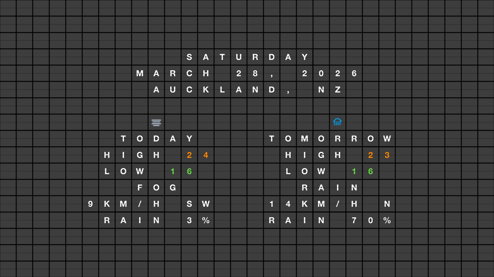

# FlipOff.

**A split-flap weather display for Samsung Frame TVs.** Real-time weather rendered in the classic flip-board style, pushed directly to your TV's art mode.



## What is this?

FlipOff turns your Samsung Frame TV into a retro split-flap weather board. It fetches live weather data, renders it as a 4K image with the mechanical flip-tile aesthetic, and uploads it directly to your TV's art mode — no hub, no app, no subscription.

The display updates every 30 minutes and automatically appears when the TV isn't in use.

## Features

- **Live weather** — today + tomorrow forecast from Open-Meteo (free, no API key)
- **Temperature colour coding** — digits go from blue (cold) through green (mild) to red (hot)
- **Weather icons** — bold SVG line art: sun, cloud, rain, snow, fog, thunderstorm
- **4K rendering** — crisp at 3840×2160, designed for the Frame's art mode
- **Direct TV upload** — pushes via websocket to the Frame's art channel, no SmartThings needed
- **Art mode watcher** — daemon detects when the TV powers off (e.g. Apple TV CEC) and switches back to art mode
- **30-minute refresh** — weather stays current without manual intervention
- **Quiet updates** — refreshes the image in the background without interrupting active TV use
- **Works with 2020+ Frame TVs** — custom websocket handler for models that send `ms.channel.connect` before `ms.channel.ready`

## Quick Start

### 1. Install dependencies

```bash
pip install playwright websocket-client
playwright install chromium
```

### 2. Configure

```bash
cp cli/.env.example cli/.env
```

Edit `cli/.env` with your location and TV IP:

```bash
FLIPFRAME_LATITUDE=-36.85
FLIPFRAME_LONGITUDE=174.76
FLIPFRAME_TIMEZONE=Pacific/Auckland
FLIPFRAME_LOCATION=AUCKLAND, NZ
FLIPFRAME_TV_IP=192.168.1.100
```

### 3. Preview

```bash
# Open in your browser
python3 cli/flipframe.py preview

# Or generate 4K screenshots without pushing
python3 cli/flipframe.py generate
```

### 4. Push to TV

```bash
# Upload to Frame TV art mode
python3 cli/flipframe.py push

# Upload without switching TV to art mode (background update)
python3 cli/flipframe.py push --quiet
```

### 5. Auto-refresh (optional)

**Option A: Cron** — simple daily push at 5:30 AM:

```bash
crontab -e
# 30 5 * * * /path/to/flipoff/cli/refresh.sh
```

**Option B: Art mode watcher daemon** — watches Home Assistant for TV power-off events, switches back to art mode, and refreshes weather every 30 minutes:

```bash
# Run directly
python3 cli/artmode-watcher.py

# Or install as a launchd service (macOS)
cp com.flipframe.artmode-watcher.plist ~/Library/LaunchAgents/
launchctl load ~/Library/LaunchAgents/com.flipframe.artmode-watcher.plist
```

The watcher requires a Home Assistant instance with the TV entity exposed. Set `HA_URL` and `HA_TOKEN` as environment variables or edit the defaults in the script.

## CLI Commands

| Command | Description |
|---------|-------------|
| `flipframe.py push` | Fetch weather, render 4K image, upload to TV |
| `flipframe.py push --quiet` | Same, but don't switch TV to art mode |
| `flipframe.py artmode` | Wake TV and switch to art mode (no render) |
| `flipframe.py preview` | Open weather display in local browser |
| `flipframe.py generate` | Render 4K screenshots to `cli/output/` |
| `flipframe.py live` | Serve animated display on TV browser (experimental) |

## How It Works

1. **Weather fetch** — pulls forecast from [Open-Meteo](https://open-meteo.com/) (free, no key)
2. **Content generation** — builds a split-flap grid layout with date, location, conditions, temperature, wind, and rain probability
3. **4K capture** — renders `kiosk.html` in headless Chromium at 3840×2160 via Playwright
4. **TV upload** — connects to the Frame TV's websocket art channel, removes old images, uploads the new one, and sets it as current

The art mode watcher adds two background jobs:
- **State listener** — subscribes to Home Assistant events; when the TV entity goes `off`, it wakes the TV via WoL and switches to art mode
- **Refresh loop** — every 30 minutes, regenerates and quietly pushes fresh weather (skips if TV is unreachable)

## File Structure

```
flipoff/
  cli/
    flipframe.py          — Main CLI: weather fetch, render, TV upload
    artmode-watcher.py    — Daemon: HA watcher + 30-min weather refresh
    refresh.sh            — Cron wrapper for daily push
    .env.example          — Configuration template
  kiosk.html              — Data-driven display (rendered by CLI)
  index.html              — Standalone browser demo (quotes mode)
  css/                    — Styles (layout, tiles, weather icons, responsive)
  js/                     — Split-flap engine, kiosk mode, weather icon rendering
```

## License

MIT
